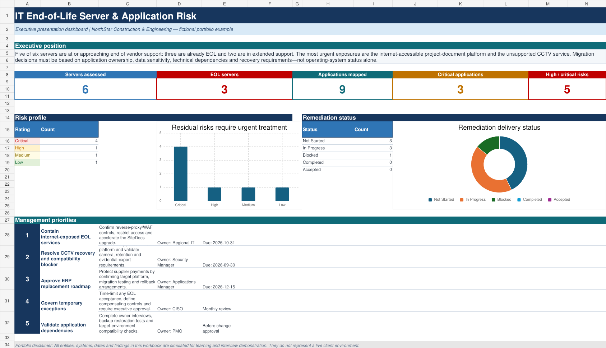

# IT End-of-Life Server & Application Risk Assessment

A simulated GRC portfolio project by **Sal Idriss** for the fictional organisation **NorthStar Construction & Engineering Ltd**.

## Project objective

Assess security, operational and business-continuity risks created by end-of-life servers while identifying every hosted application, owner, dependency and migration requirement.

## Workbook contents

The [presentation-ready Excel workbook](IT_End_of_Life_Server_Application_Risk_Presentation.xlsx) includes:

- Executive dashboard with risk and remediation KPIs
- Server register covering support status, EOL dates, exposure, patching and backups
- Application inventory with business ownership, data classification and dependency mapping
- 25-question application discovery questionnaire
- Likelihood-and-impact risk assessment with residual-risk scoring
- Upgrade, migration, replacement, retirement and exception tracker
- Guidance, scoring rules and editable dropdown fields

## Key scenario findings

- Six servers assessed
- Three servers already end of life
- Nine hosted applications mapped
- Three applications rated business-critical
- Five residual risks rated High or Critical
- Highest priorities: internet-accessible legacy services, unsupported CCTV infrastructure and ERP replacement

## Capabilities demonstrated

Asset and application discovery · technology lifecycle governance · application dependency mapping · vulnerability and patch-risk analysis · risk scoring · compensating controls · remediation planning · risk acceptance · executive reporting.

## Important disclaimer

All organisations, systems, owners, dates, risks and findings are fictional. This is an independent learning and interview portfolio project and contains no employer, supplier or client information.
